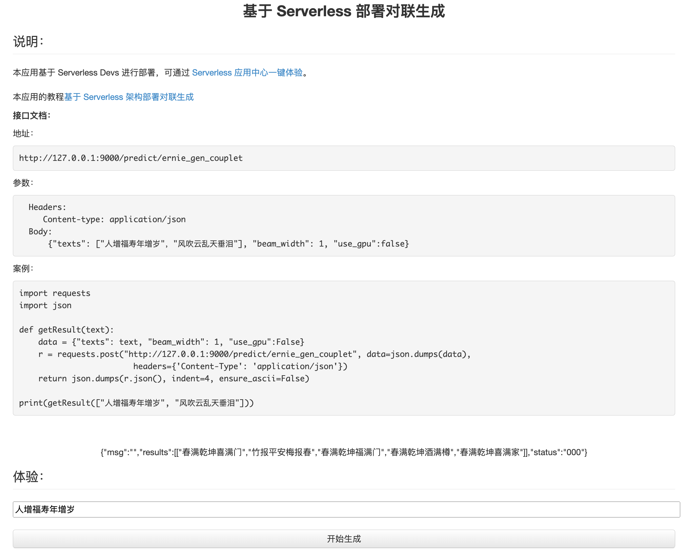

# 基于 Serverless 部署对联生成

大家可以通过本项目提供的镜像，快速发布成可调用的Restful API服务。

# [ernie_gen_couplet](https://github.com/PaddlePaddle/PaddleHub/tree/release/v2.2/modules/text/text_generation/ernie_gen_couplet)

| 模型名称            | ernie_gen_couplet |
| :------------------ | :---------------: |
| 类别                |   文本-文本生成   |
| 网络                |     ERNIE-GEN     |
| 数据集              |  开源对联数据集   |
| 是否支持Fine-tuning |        否         |
| 模型大小            |       421M        |
| 最新更新日期        |    2021-02-26     |
| 数据指标            |         -         |

## 一、模型基本信息

- 模型介绍
  - ERNIE-GEN 是面向生成任务的预训练-微调框架，首次在预训练阶段加入span-by-span 生成任务，让模型每次能够生成一个语义完整的片段。在预训练和微调中通过填充式生成机制和噪声感知机制来缓解曝光偏差问题。此外, ERNIE-GEN 采样多片段-多粒度目标文本采样策略, 增强源文本和目标文本的关联性，加强了编码器和解码器的交互。
  - ernie_gen_couplet采用开源对联数据集进行微调，输入上联，可生成下联。

<p align="center">

</p>


# 部署方法

# 1. 在阿里云函数计算应用中心里立即创建

[阿里云Serverless 应用中心一键体验 ](https://fcnext.console.aliyun.com/applications/create?template=paddleErnieGenCouplet)



# 2. 终端上输入命令创建

```shell

s init paddleErnieGenCouplet  # 初始化项目
s deploy  # 部署项目

```

# 调用方法

```python
import requests
import json

def getResult(text):
    data = {"texts": text, "beam_width": 1, "use_gpu":False}
    r = requests.post("http://127.0.0.1:9000/predict/ernie_gen_couplet", data=json.dumps(data),
                        headers={'Content-Type': 'application/json'})
    return json.dumps(r.json(), indent=4, ensure_ascii=False)

print(getResult(["人增福寿年增岁", "风吹云乱天垂泪"]))

```

```json
{
    "msg": "",
    "results": [
        [
            "春满乾坤喜满门",
            "竹报平安梅报春",
            "春满乾坤福满门",
            "春满乾坤酒满樽",
            "春满乾坤喜满家"
        ],
        [
            "雨打花残地痛心",
            "雨打花残地皱眉",
            "雨打花残地动容",
            "雨打霜欺地动容",
            "雨打花残地洒愁"
        ]
    ],
    "status": "000"
}
```

# 本应用的镜像开发教程

https://github.com/duolabmeng6/paddlehub_ppocr

阅读本文你将学会：

在 Serverless 架构中 docker 镜像制作的最佳实践，游刃有余的部署复杂场景下的深度学习模型

熟练的使用各厂商提供的 Serverless 服务，部署。

制作小巧精良的 docker 镜像

# 常用命令
```shell
s cli registry login # 登录授权 一次就行
s cli registry publish # 发布包
s cli registry list # 查看子机已发布的包

s init paddleErnieGenCouplet # 自己测试应用的效果
s deploy # 部署项目试试
```